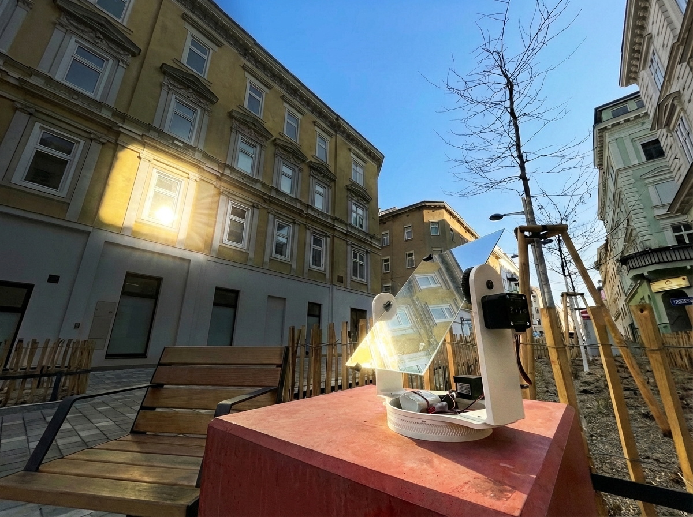

# Heliostat Sun Tracker




A WiFi-controlled 2-axis mirror alignment system.

## Project Status

**Current Milestone**: Mirror positioning and manual alignment  
The heliostat can be manually aligned north, then automatically track the sun's position. Full heliostat functionality (reflecting sun to a fixed target) requires additional developemet.

## Hardware Components

| Component | Purpose |
|-----------|---------|
| **ESP32-S3** | Brain/Controller |
| **NEMA17 Steppers** (×2) | Motion |
| **A4988 Drivers** (×2) | Stepper Control |
| **30×21 cm Mirror** | Reflection |
| **3D-Printed Structure** | Mechanics |
| **Gear Ratios** | Torque & Precision |
| **11.1V Li-ion Battery** | Power |
| **LM2596** | Voltage Regulation |

## Features

- **WiFi Web Interface** – Control via phone or computer
- **Manual Mode** – D-pad style controller for precise alignment
- **Automatic Sun Tracking** – Calculates sun position using NTP time and geolocation
- **Setup Wizard** – Easy configuration: compass alignment, location input, timezone selection
- **Non-Volatile Storage** – Settings persist across reboots
- **Calibration Ready** – Gear ratio constants stored for fine-tuning

## Quick Start

### 1. Flash the Firmware
```bash
cd firmwear/heliostat
~/.platformio/penv/bin/platformio run --target upload
```

### 2. Connect to WiFi
- Update WiFi credentials in `src/main.cpp` (lines 7–8)
- ESP32 boots and connects to WiFi
- Serial monitor shows connection status and IP of ESP

### 3. Setup
Follow the on-screen steps for:
1. **Align to North**: Manually point mirror vertically north.
2. **Location**: Use geolocation or enter manually, select timezone and DST.
3. **Finish Setup**: System syncs time via NTP, ready for tracking.

### 4. Track the Sun
- Go to **Tracking** tab
- Click **"Start Tracking"**
- Mirror follows sun across the sky
- Real-time display shows: Sun azimuth & elevation, mirror target position, local time
- Click **"Stop"** to pause

## Technical Details

- **Sun Position Calculation**: Uses SolarCalculator library (NOAA algorithm).
- **Time Synchronization**: NTP (Network Time Protocol) via `pool.ntp.org`.
- **Tracking Algorithm**: Updates sun position every 60 seconds.

## Next Milestones

### Phase 2: Target Direction Setup
- Add UI to set receiver/target direction.
- Compute mirror normal from sun + target angles for true heliostat function.

### Phase 3: Hardware Enhancements
- Add DS3231 RTC module.
- Add MPU-6500 module.
- LCD status display.

## License

Portfolio project. Modify and adapt as needed.
